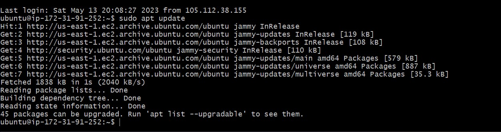
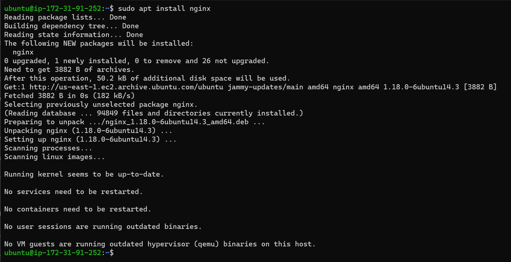
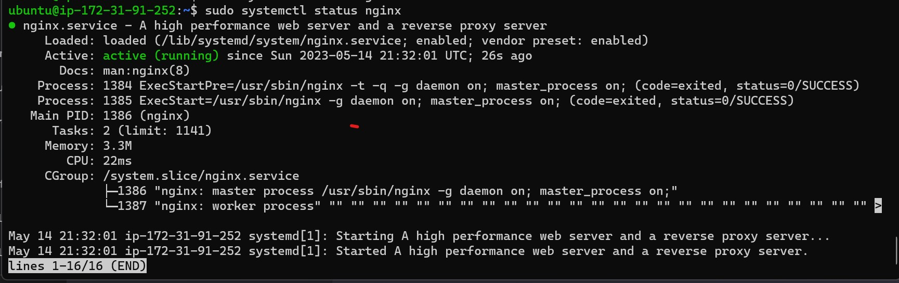
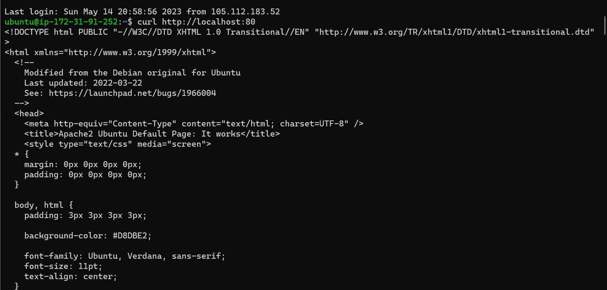
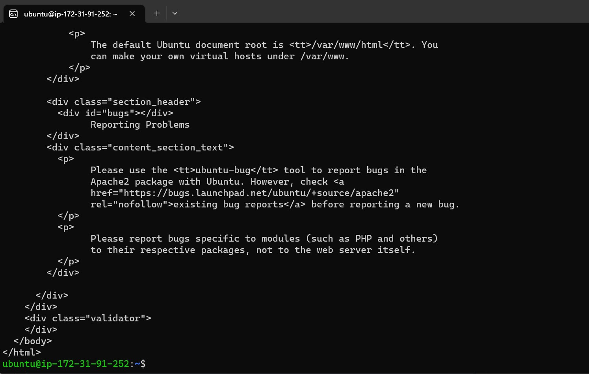
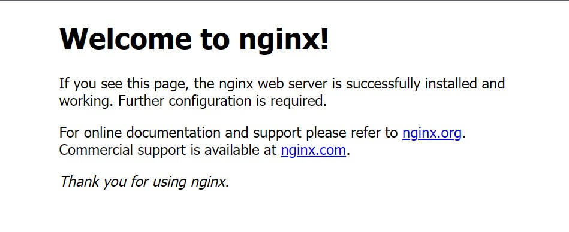

##  **PROJECT 2: LEMP STACK IMPLEMENTATION**

### **Installing the Nginx Web Server**
### I will be installing Nginx for displaying the web pages to our site visitors.
### I will start the installation Nginx by updating my server’s package index if it is the first time I am using the apt on the server, and I will be using the below command for the update.

**`sudo apt update`**

### When the apt update is completed I will have to install the Nginx web server using the below command.

**`sudo apt install Nginx`**

### When the Nginx installation is completed. I will have to confirm the **status** if it is running. And the **active running** will be in green font color, and this means that the installation is successful, and the web server is launched in the cloud.

### I used the below command to confirm the Nginx status.

**`sudo systemctl status Nginx`**

## **Enable Traffic access to the Web server**

### Before the web server can recieve any traffic I will need to open TCP port 80 which is default port that web browsers use to access web pages from the Internet.
### To achieve this in the AWS. I will need to add a rule to EC2 configuration to open inbound connection through port 80, as shown below.

### - Check the box in front of the EC2 instance
### - Select security
### - Under inbound rules, select security group
### - Click on edit inbound rules and select HTTP from the options to add port 80 with source IP:0.0.0.0

### **Accessing the web server locally**
### I can access the web server locally through the Internet Source 0.0.0.0/0 which  means from any IP address
### I tried to access the web server locally in my Ubuntu shell by running either of the below url.

**`curl http://localhost:80`** 

**`curl http://127.0.0.1:80`** 

### **Nginx Server Respond to Requests**
### Now is the time to test if my Nginx server can respond to requests from the Internet. 
### I will have to open any web browser from my system and try to access it using the below url, by adding my EC2 instace public IP

**`http://<Public-IP-Address>:80`** 

