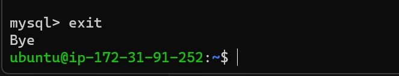

##  **PROJECT 2: LEMP STACK IMPLEMENTATION**

### **Installing the Nginx Web Server**
### I will be installing Nginx for displaying the web pages to our site visitors.
### I will start the installation Nginx by updating my server’s package index if it is the first time I am using the apt on the server, and I will be using the below command for the update.

**`sudo apt update`**

### When the apt update is completed I will have to install the Nginx web server using the below command.

**`sudo apt install Nginx`**

### When the Nginx installation is completed. I will have to confirm the **status** if it is running. And the **active running** will be in green font color, and this means that the installation is successful, and the web server is launched in the cloud.

### I used the below command to confirm the Nginx status.

**`sudo systemctl status Nginx`**

## **Enable Traffic access to the Web server**

### Before the web server can recieve any traffic I will need to open TCP port 80 which is default port that web browsers use to access web pages from the Internet.
### To achieve this in the AWS. I will need to add a rule to EC2 configuration to open inbound connection through port 80, as shown below.

### - Check the box in front of the EC2 instance
### - Select security
### - Under inbound rules, select security group
### - Click on edit inbound rules and select HTTP from the options to add port 80 with source IP:0.0.0.0

### **Accessing the web server locally**
### I can access the web server locally through the Internet Source 0.0.0.0/0 which  means from any IP address
### I tried to access the web server locally in my Ubuntu shell by running either of the below url.

**`curl http://localhost:80`** 

**`curl http://127.0.0.1:80`** 

### **Nginx Server Respond to Requests**
### Now is the time to test if my Nginx server can respond to requests from the Internet. 
### I will have to open any web browser from my system and try to access it using the below url, by adding my EC2 instace public IP

**`http://<Public-IP-Address>:80`** 

### **INSTALLING MYSQL**

### After the web server is already installed, we will have to installed MySQL to to enable me store and manage data for the site as a Database Management System (DBMS)  MySQL is a popular relational database management system

### In other to get the MySQL installed I will use the command below, and when prompted, confirm installation by typing Y, and then press the ENTER key.

**`sudo apt install mysql-server`** 

### After the installation is completed, I will connect to the MySQL server as the administrative database user root, which is inferred by the use of sudo, and -p in the command, and this will prompt you for the password, I then entered the password to access the MySQL to ensure all I have done is okay. 

### Lastly, I exit MySQL console using my exit command below.

**`sudo mysql -p`** & **`exit`**

## **INSTALLING PHP**

### At this stage I will be install PHP to support in processing code and generate dynamic content for the web server.

### In other to allows a better performance in all PHP-based websites as a requirement, Nginx will requires an external program to handle the PHP process, and also act as a bridge between the PHP interpreter and the web server.

### Inother to get a better performance I installed php-fpm (PHP fastCGI process manager), which tell's Nginx to pass PHP requests to the software for processing. php-mysql will also be installed and it is a PHP module that allows PHP to communicate with MySQL-based databases, and lastly, the core PHP packages will automatically be installed as dependencies.

### **The below command will be used to install the two (2) packages, php-fpm & php-mysql at once.**

**`sudo apt install php-fpm php-mysql`**

## **CONFIGURING NGINX TO USE PHP PROCESSOR**
### Alfter we have PHP components installed the next action will be to configure Nginx to use the php-fpm & php-mysql.

### **- Configure Nginx to Use PHP Processor**
### When using the Nginx web server, I can create server blocks to encapsulate configuration details and host multiple domain on a single server. In this project, I will use projectLEMP as my domain name.

### Nginx has one server block enabled by default and is configured to serve documents out of a directory at /var/www/html. this works well for a single site, but it is difficult to manage if it is hosting multiple sites. 
### We will create another directory structure  within /var/www for my domain website, while leaving /var/www/html to serve as the default directory if cient request do not match any other sites.

### To create the root web directory for my domain i use the below command.

**`sudo mkdir /var/www/projectLEMP`**

### Once I have created the domain (/var/www/projectLEMP/), The next acrion is to assign ownership to the directory with the $USER environment variable, which will reference my current system user by using the below command.

**`sudo chown -R $USER:$USER /var/www/projectLEMP`**

### After the user is created, I will open a new configuration file in Nginx’s sites-available directory using nano command-line editor by using the below command line, and this create a new blank file, and I paste in the following bare-bones configuration as shown below.

**`sudo nano /etc/nginx/sites-available/projectLEMP`**

### **bare-bones configuration**

